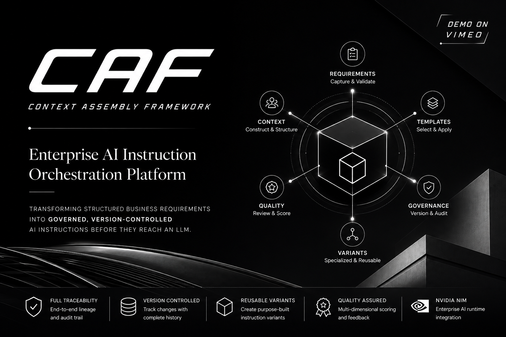
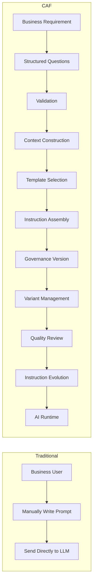
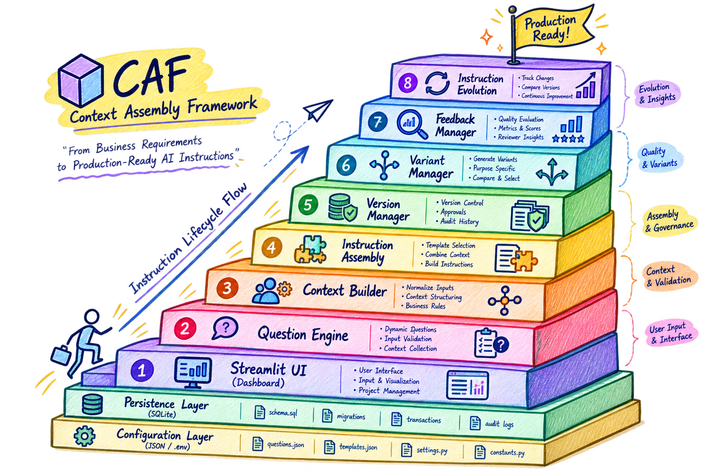
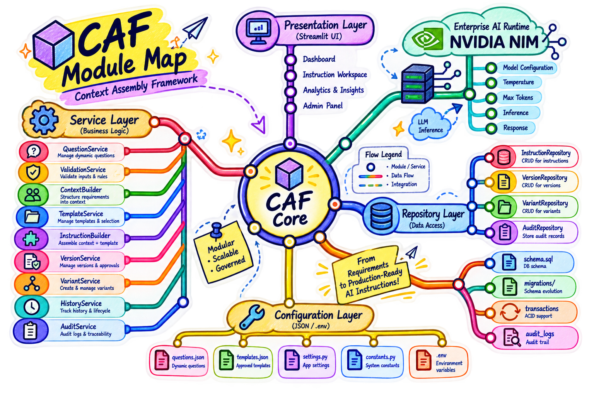
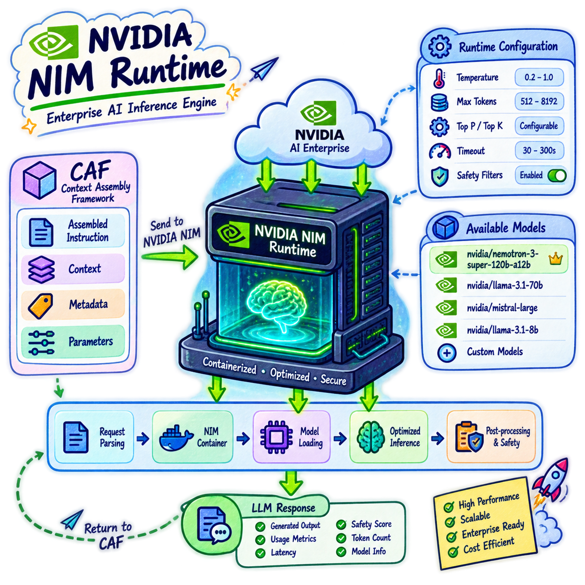
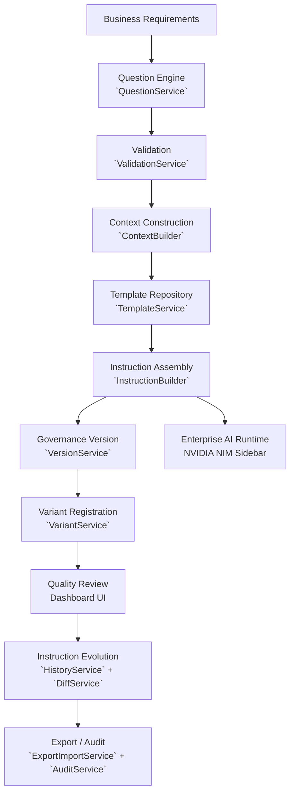
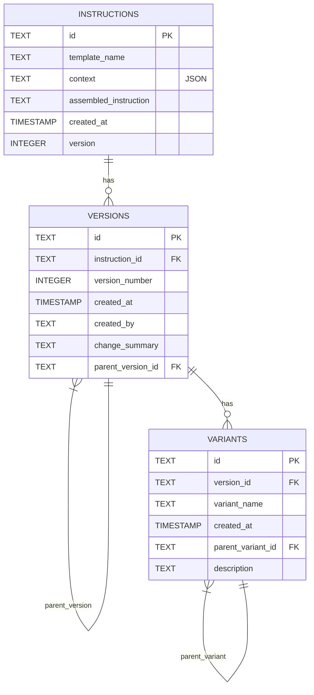

# CAF — Context Assembly Framework

**Enterprise-oriented AI instruction orchestration platform for transforming structured business requirements into governed, version-controlled AI instructions.**


---

## 🎥 Demo

[](https://vimeo.com/1216770893)

**Walkthrough of the Context Assembly Framework**, demonstrating the instruction orchestration workflow, governance capabilities, and enterprise AI runtime integration.

---

## Overview

CAF (Context Assembly Framework) is an enterprise-oriented **AI instruction orchestration platform**. It structures and governs the transformation of business requirements into standardized, traceable AI instructions before they reach an LLM.

### Why CAF Exists

At enterprise scale, prompt construction becomes a **governance challenge**:

| Traditional Workflow | CAF Workflow |
|---------------------|--------------|
| Business user manually writes prompt | Structured requirement capture via configurable questionnaire |
| No validation before LLM call | Automated validation against question schemas |
| Prompt sent directly to LLM | Context → Template → Instruction assembly pipeline |
| No version control | Governance versioning with explicit lineage |
| No variant management | Specialized variants derived from governed versions |
| No quality governance | Multi-dimensional human quality review with scoring |
| No traceability | Complete audit trail and diff-based evolution tracking |

CAF addresses these by treating **instructions as governed artifacts** — versioned, validated, reviewed, and traceable — while remaining agnostic to the downstream LLM runtime.

---

## The Problem



---

## Visual Architecture

### CAF Architecture



*High-level architecture showing the instruction orchestration pipeline: Business Requirements → Question Engine → Context Builder → Template Repository → Instruction Assembly → Governance Version → Variant Management → Quality Review → Instruction Evolution → AI Runtime. The governance layer (CAF) is strictly separated from the inference runtime (NVIDIA NIM).*

### CAF Module Map



*Module dependency map reflecting the actual codebase structure. Layers: config (questions.json, templates), core (DI container), database (SQLite + transactions), models (Pydantic domain models), repositories (protocol + in-memory + SQLite implementations), services (13 single-responsibility services), ui (Streamlit demo apps), utils (placeholder parser, logging). Dependency direction flows downward; services depend on repository protocols, not implementations.*

### NVIDIA NIM Runtime



*Enterprise AI Runtime integration showing NVIDIA NIM as the inference provider. The sidebar exposes model selection (Llama 3.3 70B, Nemotron Ultra 253B, DeepSeek R1, Mistral Large 2, Qwen 3 235B), inference parameters (temperature, max tokens, mode), connection testing against the hosted `integrate.api.nvidia.com/v1/models` endpoint, and API key management via environment variable. This runtime layer is fully separated from the instruction governance layer.*

---

## Core Capabilities

| Capability | Description |
|------------|-------------|
| **Business Requirement Capture** | Configurable questionnaire engine (`caf/config/questions.json`) with 10 structured fields: objective, audience, tone, output_format, risk_level, language, purpose, business_type, constraints, word_limit |
| **Dynamic Question Engine** | `QuestionService` loads questions from JSON; supports `text`, `select`, `multiselect` types with required/optional flags, placeholders, and option lists |
| **Automated Validation** | `ValidationService` validates answers against schemas: required checks, min/max length, option enumeration; returns structured `ValidationResult` with errors/warnings |
| **Context Construction** | `ContextBuilder` transforms validated answers into a typed `Context` Pydantic model (10 fields) with automatic type coercion (comma-separated strings → lists, string → int) |
| **Template Management** | `TemplateService` loads validated templates from `default_templates.json` (General Prompt, Business Analysis, Software Engineering); enforces placeholder/template-text consistency via `PlaceholderParser` |
| **Instruction Assembly** | `InstructionBuilder` performs deterministic `{{placeholder}}` substitution using `PlaceholderParser`; produces downloadable `Instruction` artifacts with metadata |
| **Governance Versioning** | `VersionService` creates sequential versions with `parent_version_id` lineage; `change_summary` and `created_by` for audit; atomic persistence via `Transaction` context manager |
| **Variant Management** | `VariantService` creates named variants per version with optional `parent_variant_id` for variant lineage; 6 variant types demonstrated in dashboard (Enterprise Standard, Compliance Optimized, Executive Brief, Developer Edition, Risk Assessment, Audit Ready) |
| **History & Lineage** | `HistoryService` aggregates full instruction history (instruction + versions + variants_by_version); `DiffService` computes unified diffs with similarity scoring (0–100) using `difflib` |
| **Quality Review** | Dashboard captures 6 scoring dimensions (Quality, Hallucination Risk, Compliance, Completeness, Consistency, Governance Alignment) + tags, manual refinement flag, reviewer notes — stored in session state for demonstration |
| **Full Audit Trail** | `AuditService` logs all operations (`InstructionCreated`, `VersionCreated`, `VariantCreated`, `VersionsCompared`, `HistoryRetrieved`, `LatestVersionRequested`) with timestamps, actors, metadata — in-memory event store |
| **Export/Import** | `ExportImportService` bundles instruction + versions + variants as JSON (`ExportBundle`); round-trip import with upsert semantics |
| **NVIDIA NIM Integration** | Hosted API integration: model selection, temperature, max tokens, inference modes; connection testing against `integrate.api.nvidia.com/v1/models`; authentication via `NVIDIA_API_KEY` environment variable |

---

## Instruction Assembly Lifecycle



### Stage Details

| Stage | Component | Input | Output | Purpose |
|-------|-----------|-------|--------|---------|
| 1. Requirements | `QuestionService` | `questions.json` | Question[] | Structured intake |
| 2. Validation | `ValidationService` | Answers + Questions | ValidationResult[] | Schema enforcement |
| 3. Context | `ContextBuilder` | Validated Answers | `Context` (Pydantic) | Typed context object |
| 4. Template | `TemplateService` | `default_templates.json` | Template[] | Approved templates |
| 5. Assembly | `InstructionBuilder` | Template + Context | `Instruction` | Deterministic substitution |
| 6. Version | `VersionService` | Instruction + Summary | `Version` (v1, v2…) | Governance baseline |
| 7. Variant | `VariantService` | Version + Name | `Variant` | Specialized derivatives |
| 8. Quality | Dashboard UI | Reviewer input | Scores + Notes | Human governance |
| 9. Evolution | `HistoryService` + `DiffService` | Version chain | DiffResult[] | Change tracking |
| 10. Export | `ExportImportService` | Full history | JSON Bundle | Portability / Archive |
| 11. Runtime | NIM Sidebar | Assembled instruction | LLM Response | Inference (separate layer) |

---

## Architecture

CAF follows a **clean, layered architecture** with strict dependency direction:

```
┌─────────────────────────────────────────────────────────────┐
│                     Presentation (UI)                       │
│  demo_app.py  •  demo_dashboard.py  •  questions.py         │
├─────────────────────────────────────────────────────────────┤
│                     Application / Services                  │
│  QuestionService, ValidationService, ContextBuilder,        │
│  TemplateService, InstructionBuilder, InstructionPipeline,  │
│  VersionService, VariantService, HistoryService,            │
│  DiffService, AuditService, ExportImportService             │
├─────────────────────────────────────────────────────────────┤
│                       Domain Models                         │
│  Context, Instruction, Template, Version, Variant,          │
│  ValidationResult, DiffResult, PipelineResult,              │
│  InstructionHistory, ExportBundle, AuditEvent               │
├─────────────────────────────────────────────────────────────┤
│                      Repository Layer                       │
│  RepositoryProtocol (Instruction, Version, Variant)         │
│  ◄──── In-Memory (BaseRepository)                          │
│  ◄──── SQLite (SQLiteBaseRepository)                       │
├─────────────────────────────────────────────────────────────┤
│                      Persistence                            │
│  SQLite (schema.sql)  •  Transaction Manager                │
├─────────────────────────────────────────────────────────────┤
│                   Configuration / Utils                     │
│  questions.json, default_templates.json, settings.py,       │
│  constants.py, PlaceholderParser, logging                   │
└─────────────────────────────────────────────────────────────┘
```

### Key Architectural Decisions

| Decision | Implementation |
|----------|----------------|
| **Dependency Injection** | `Container` class (`caf/core/container.py`) with lazy initialization; supports both in-memory and SQLite repositories via `use_sqlite` flag |
| **Repository Pattern** | Protocol-based interfaces (`InstructionRepositoryProtocol`, `VersionRepositoryProtocol`, `VariantRepositoryProtocol`) with dual implementations |
| **Transaction Atomicity** | `Transaction` context manager (`caf/database/transaction.py`) wraps multi-repo writes; auto-rollback on exception |
| **Configuration-Driven** | Questions and templates loaded from JSON; no code changes needed to modify intake or templates |
| **Type Safety** | Pydantic models throughout; MyPy strict mode enforced in CI |
| **Separation of Concerns** | Services are single-responsibility; pipeline orchestrates but doesn't contain business logic |
| **Runtime Separation** | Instruction governance (CAF) strictly separated from inference runtime (NIM) |

---

## Core Modules

| Layer | Component | Responsibility |
|-------|-----------|----------------|
| **Presentation** | `demo_app.py` | Step-by-step workflow demo (4 steps: Questions → Template → Instruction → Version) |
| | `demo_dashboard.py` | Enterprise dashboard with 8 tabs covering full lifecycle + NIM runtime sidebar |
| | `questions.py` | UI helpers for question rendering |
| **Services** | `question_service.py` | Loads/validates questions from JSON; delegates validation to `ValidationService` |
| | `validation_service.py` | Schema validation for text/select/multiselect; structured `ValidationResult` |
| | `context_builder.py` | Converts raw answers → typed `Context` model; type coercion |
| | `template_service.py` | Loads/validates templates; placeholder/template consistency via `PlaceholderParser` |
| | `instruction_builder.py` | Assembles `Instruction` via placeholder substitution |
| | `instruction_pipeline.py` | Orchestrates full pipeline in single transaction; integrates all services |
| | `version_service.py` | Creates versions with sequential numbering + parent lineage |
| | `variant_service.py` | Creates variants with optional parent variant lineage |
| | `history_service.py` | Aggregates instruction + versions + variants into `InstructionHistory` |
| | `diff_service.py` | Compares versions; unified diff + similarity score (0–100) |
| | `audit_service.py` | Logs all operations as `AuditEvent` (in-memory list) |
| | `export_import_service.py` | Bundles instruction+versions+variants as JSON; round-trip import |
| **Domain Models** | `context.py` | 10-field Pydantic model (objective, audience, tone, constraints[], output_format, risk_level, language, word_limit?, purpose, business_type) |
| | `instruction.py` | Assembled instruction with metadata (id, template_name, context, assembled_instruction, created_at, version) |
| | `template.py` | Template with validated placeholders; self-validates on construction |
| | `version.py` | Governance version (id, instruction_id, version_number, change_summary, created_by, parent_version_id) |
| | `variant.py` | Specialized variant (id, version_id, variant_name, description, parent_variant_id) |
| | `validation.py` | `ValidationResult` with is_valid, errors[], warnings[] |
| | `diff_result.py` | Comparison result (added/removed/changed lines, similarity_score, unified_diff) |
| | `pipeline_result.py` | Pipeline execution result (instruction, version, variant, success, error) |
| | `instruction_history.py` | Aggregated view: instruction + versions[] + variants_by_version{} |
| | `export_bundle.py` | Portable export: instruction + versions[] + variants[] + metadata |
| | `audit_event.py` | Audit log entry (event_type, entity_type, entity_id, performed_by, timestamp, metadata) |
| **Repositories** | `base_repository.py` | Protocol definitions + in-memory `BaseRepository` (CRUD + insertion order) |
| | `sqlite_base_repository.py` | SQLite implementation with upsert (ON CONFLICT), parameterized queries |
| | `sqlite_instruction_repository.py` | Instruction ↔ SQLite (JSON context column) |
| | `sqlite_version_repository.py` | Version ↔ SQLite (FK to instruction, parent_version_id self-FK) |
| | `sqlite_variant_repository.py` | Variant ↔ SQLite (FK to version, parent_variant_id self-FK) |
| **Persistence** | `db.py` | SQLite connection manager; custom converters for timezone-aware UTC datetimes |
| | `transaction.py` | Transaction context manager with connection wrapper; auto-commit/rollback |
| | `schema.sql` | 3 tables (instructions, versions, variants) with indexes + FKs |
| **Configuration** | `questions.json` | 10 questions defining business intake schema |
| | `default_templates.json` | 3 approved templates with placeholder declarations |
| | `settings.py` | `Settings` class from env vars (DATABASE_URL, SECRET_KEY, LOG_LEVEL, NVIDIA_API_KEY) |
| | `constants.py` | Table names, pagination, limits, text constraints |
| **Utilities** | `placeholder_parser.py` | Extract/validate/replace `{{placeholder}}` patterns via regex |
| | `logging.py` | Structured logging setup |

---

## Governance & Lifecycle

CAF treats **instructions as governed artifacts** with full traceability.

### Versioning
- Sequential `version_number` per instruction (1, 2, 3…)
- `parent_version_id` creates explicit lineage chain
- `change_summary` + `created_by` for audit context
- Atomic creation via `Transaction` (instruction + version + variant together)

### Variants
- Created per version (`version_id` FK)
- `parent_variant_id` enables variant lineage (e.g., "Compliance Optimized" → "Compliance Optimized v2")
- 6 variant types demonstrated in dashboard:
  - **Enterprise Standard** — Full governance controls
  - **Compliance Optimized** — Regulatory control mappings
  - **Executive Brief** — Condensed for leadership
  - **Risk Assessment** — Threat modeling focus
  - **Developer Edition** — Implementation guidance
  - **Audit Ready** — Evidence packages + checklists

### History & Audit
- `HistoryService.get_history(instruction_id)` → `InstructionHistory` (instruction + versions + variants_by_version)
- `AuditService` logs: `InstructionCreated`, `VersionCreated`, `VariantCreated`, `VersionsCompared`, `HistoryRetrieved`, `LatestVersionRequested`
- In-memory event store (persisted audit would require additional repository)

### Diff & Evolution
- `DiffService.compare_versions(v_a, v_b)` → `DiffResult` (added/removed/changed lines, similarity_score, unified_diff)
- `DiffService.compare_latest(instruction_id)` — latest vs. parent
- `DiffService.get_version_chain(instruction_id)` — full chain of consecutive diffs
- Similarity score via `difflib.SequenceMatcher` (0–100)

---

## Quality & Review

The dashboard (`demo_dashboard.py` tab 7) captures **human quality review** across six dimensions:

| Dimension | Scale | Purpose |
|-----------|-------|---------|
| **Quality Score** | 1–5 | Overall instruction quality |
| **Hallucination Risk** | 1–5 | Likelihood of fabricated content (lower = better) |
| **Compliance Score** | 1–5 | Adherence to regulatory/policy requirements |
| **Completeness** | 1–5 | Coverage of required elements |
| **Consistency** | 1–5 | Internal coherence and terminology |
| **Governance Alignment** | 1–5 | Alignment with enterprise governance standards |

**Additional capture:**
- **Tags** (multiselect): Accurate, Concise, Comprehensive, Context Aware, Governance Aligned, Production Ready, Requires Revision
- **Manual Refinement** flag: Reviewer edited the instruction
- **Reviewer Notes**: Free-text observations

> **Important**: These are **human-recorded evaluations** stored in Streamlit session state for demonstration. CAF does not implement automated LLM-based evaluation. The review data influences the demonstration lifecycle (e.g., linked to Version 3 creation in the dashboard) but is not persisted to the repository layer.

> **Distinction**: 
> - **Automated validation** — `ValidationService` validates answer schemas (required, length, options)
> - **Human review** — Dashboard captures 6 scoring dimensions + notes
> - **Stored metadata** — Scores/notes held in session state; not written to SQLite

---

## NVIDIA NIM Integration

CAF integrates **NVIDIA NIM** as the enterprise AI inference runtime — **separate from the governance layer**.

### Configuration (Sidebar in `demo_dashboard.py`)

| Parameter | Values | Description |
|-----------|--------|-------------|
| **Provider** | NVIDIA NIM | Inference provider |
| **Model** | Llama 3.3 70B, Nemotron Ultra 253B, DeepSeek R1, Mistral Large 2, Qwen 3 235B, Custom Endpoint | NIM model selection |
| **Temperature** | 0.0 – 1.0 (default 0.2) | Generation randomness |
| **Max Tokens** | 256 – 32768 (default 4096) | Response length limit |
| **Inference Mode** | Enterprise Managed, Balanced, High Accuracy, Fast Response | Preconfigured profiles |

### Connection Testing
- **Endpoint**: `https://integrate.api.nvidia.com/v1/models`
- **Authentication**: `NVIDIA_API_KEY` from environment (`.env`)
- **Test**: Lightweight GET request; measures latency; updates connection status (Not Validated / Ready / Failed)
- **Status Display**: Provider, endpoint, auth status, latency (ms)

### Architecture Position

```
┌────────────────────────────────────────┐
│      Instruction Governance Layer      │
│  (CAF: Assembly, Versioning, Variants, │
│   Quality, Audit, Export)              │
└─────────────────┬──────────────────────┘
                  │ Assembled Instruction
                  ▼
┌────────────────────────────────────────┐
│      Enterprise AI Runtime (NIM)       │
│  Model Selection, Params, Connection   │
│  Inference Execution (External)        │
└────────────────────────────────────────┘
```

> **Note**: CAF does **not** deploy or manage NIM containers. It uses the hosted NVIDIA API endpoint (`integrate.api.nvidia.com`). The runtime configuration is stored in Streamlit session state for the demo; production deployments would externalize this configuration.

---

## Data & Persistence

### SQLite Schema (`caf/database/schema.sql`)



### Tables

| Table | Purpose | Key Columns |
|-------|---------|-------------|
| `instructions` | Base assembled instructions | `id` (PK), `template_name`, `context` (JSON), `assembled_instruction`, `created_at`, `version` |
| `versions` | Governance versions per instruction | `id` (PK), `instruction_id` (FK), `version_number` (unique per instruction), `change_summary`, `created_by`, `parent_version_id` (self-FK) |
| `variants` | Specialized variants per version | `id` (PK), `version_id` (FK), `variant_name`, `description`, `parent_variant_id` (self-FK) |

### Persistence Features
- **Foreign keys enforced** (`PRAGMA foreign_keys = ON`)
- **Indexes** on FK columns and timestamps for query performance
- **Upsert semantics** (`INSERT ... ON CONFLICT DO UPDATE`) via `SQLiteBaseRepository`
- **Timezone-aware UTC** datetimes via custom SQLite converters
- **Transaction management** — `Transaction` context manager wraps multi-repo operations with auto-rollback

### Initialization
```python
from caf.database.db import init_db
init_db()  # Executes schema.sql
```

---

## Configuration

### Environment Variables (`.env.example`)

| Variable | Default | Description |
|----------|---------|-------------|
| `APP_NAME` | "Context Assembly Framework" | Application name |
| `APP_VERSION` | "0.1.0" | Application version |
| `DEBUG` | "False" | Debug mode |
| `DATABASE_URL` | "sqlite:///./caf.db" | SQLite connection string |
| `DATABASE_ECHO` | "False" | SQL logging |
| `SECRET_KEY` | (required in prod) | Session/crypto secret |
| `UPLOAD_DIR` | "./uploads" | File upload directory |
| `TEMPLATE_DIR` | "./caf/templates" | Template directory |
| `LOG_LEVEL` | "INFO" | Logging level |
| `NVIDIA_API_KEY` | (required for NIM) | NVIDIA NIM API key |

> `.env` is **local-only** and excluded from version control via `.gitignore`. Use `.env.example` as a template.

### Questions (`caf/config/questions.json`)

10 structured questions defining the business intake:

| ID | Type | Required | Options / Notes |
|----|------|----------|-----------------|
| `objective` | text | ✓ | Free text |
| `audience` | select | ✓ | Customers, Employees, Investors, Partners, General Public, Software Engineers, Other |
| `tone` | select | ✓ | Formal, Informal, Persuasive, Informative, Humorous, Professional, Technical |
| `output_format` | select | ✓ | Blog Post, Email, Social Media Post, Report, Presentation, Video Script, Markdown, Other |
| `risk_level` | select | ✓ | Low, Medium, High |
| `language` | select | ✓ | English, Spanish, French, German, Chinese, Other |
| `purpose` | select | ✓ | Inform, Persuade, Entertain, Educate, Inspire, Other |
| `business_type` | select | ✓ | Technology, Healthcare, Finance, Education, Retail, Manufacturing, Consulting, SaaS, Other |
| `constraints` | text | ✗ | Comma-separated list |
| `word_limit` | text | ✗ | Numeric string (coerced to int) |

### Templates (`caf/config/templates/default_templates.json`)

| Template ID | Name | Category | Placeholders |
|-------------|------|----------|--------------|
| `general-prompt` | General Prompt | General | objective, audience, tone, constraints, output_format, language |
| `business-analysis` | Business Analysis | Business | objective, business_type, audience, tone, constraints, output_format, language, risk_level, purpose |
| `software-engineering` | Software Engineering | Engineering | objective, business_type, audience, tone, constraints, output_format, language, risk_level, purpose, word_limit |

---

## Project Structure

```
CAF/
├── caf/
│   ├── config/
│   │   ├── templates/
│   │   │   └── default_templates.json
│   │   ├── constants.py
│   │   ├── questions.json
│   │   ├── settings.py
│   │   └── __init__.py
│   ├── core/
│   │   └── container.py
│   ├── database/
│   │   ├── migrations/
│   │   │   └── README.md
│   │   ├── db.py
│   │   ├── schema.sql
│   │   ├── transaction.py
│   │   └── __init__.py
│   ├── models/
│   │   ├── audit_event.py
│   │   ├── context.py
│   │   ├── diff_result.py
│   │   ├── export_bundle.py
│   │   ├── instruction.py
│   │   ├── instruction_history.py
│   │   ├── pipeline_result.py
│   │   ├── template.py
│   │   ├── validation.py
│   │   ├── variant.py
│   │   ├── version.py
│   │   └── __init__.py
│   ├── repositories/
│   │   ├── base_repository.py
│   │   ├── instruction_repository.py
│   │   ├── sqlite_base_repository.py
│   │   ├── sqlite_instruction_repository.py
│   │   ├── sqlite_variant_repository.py
│   │   ├── sqlite_version_repository.py
│   │   ├── variant_repository.py
│   │   ├── version_repository.py
│   │   └── __init__.py
│   ├── services/
│   │   ├── audit_service.py
│   │   ├── context_builder.py
│   │   ├── diff_service.py
│   │   ├── export_import_service.py
│   │   ├── history_service.py
│   │   ├── instruction_builder.py
│   │   ├── instruction_pipeline.py
│   │   ├── question_service.py
│   │   ├── template_service.py
│   │   ├── validation_service.py
│   │   ├── variant_service.py
│   │   ├── version_service.py
│   │   └── __init__.py
│   ├── ui/
│   │   ├── caf/
│   │   │   └── templates/
│   │   ├── demo_app.py
│   │   ├── demo_dashboard.py
│   │   ├── questions.py
│   │   └── __init__.py
│   ├── utils/
│   │   ├── logging.py
│   │   ├── placeholder_parser.py
│   │   └── __init__.py
│   ├── tests/
│   │   ├── conftest.py
│   │   ├── test_context_builder.py
│   │   ├── test_history_service.py
│   │   ├── test_instruction_builder.py
│   │   ├── test_instruction_pipeline.py
│   │   ├── test_instruction_repository.py
│   │   ├── test_integration.py
│   │   ├── test_placeholder_parser.py
│   │   ├── test_repository_helpers.py
│   │   ├── test_variant_repository.py
│   │   ├── test_version_repository.py
│   │   └── __init__.py
│   └── __init__.py
├── docs/
│   ├── architecture/
│   ├── artifacts/
│   ├── database/
│   ├── AI_CONTEXT.md
│   ├── Change_Log.md
│   ├── Decision_Log.md
│   ├── Phase_Wise_Tasks.md
│   ├── PRD.md
│   ├── Project_Context.md
│   ├── PROJECT_STATUS.md
│   ├── report.md
│   ├── SRS.pdf
│   ├── Tasks.md
│   └── Tech_Stack.md
├── examples/
├── images/
│   ├── CAF-Architecture.png
│   ├── CAF-Module-Map.png
│   ├── CAF-Nvidia-NIM-Runtime.png
│   └── thumbnail.png
├── uploads/
├── .github/
│   └── workflows/
│       └── ci.yml
├── .env.example
├── .gitignore
├── api.md
├── CHANGELOG.md
├── CODE_OF_CONDUCT.md
├── CONTRIBUTING.md
├── LICENSE
├── pyproject.toml
├── README.md
├── requirements.txt
├── run_app.py
└── SECURITY.md
```

> `.env` is intentionally omitted — it is local-only and gitignored.

---

## Technology Stack

| Technology | Purpose |
|------------|---------|
| **Python 3.12+** | Core language; type hints, dataclasses, pattern matching |
| **Streamlit 1.47+** | Web UI framework (`demo_app.py`, `demo_dashboard.py`) |
| **Pydantic 2.11+** | Data validation, serialization, settings management |
| **SQLite 3** | Embedded relational persistence (`schema.sql`, transactions) |
| **python-dotenv** | Environment variable loading |
| **NVIDIA NIM** | Enterprise AI inference runtime (hosted API) |
| **Requests** | HTTP client for NIM connection testing |
| **difflib** (stdlib) | Unified diff + similarity scoring |
| **uuid** (stdlib) | Unique identifiers |
| **datetime** (stdlib) | Timezone-aware UTC timestamps |

### Development Tooling

| Tool | Purpose |
|------|---------|
| **pytest 8.4+** | Test framework (unit + integration) |
| **pytest-cov** | Coverage reporting |
| **Ruff 0.12+** | Linting (E, W, F, I, B, C4, UP) |
| **Black 25.1+** | Code formatting (88-char line length) |
| **MyPy 1.16+** | Static type checking (strict mode) |
| **GitHub Actions** | CI pipeline (lint, format, typecheck, test, coverage) |

---

## Testing

### Test Organization

| Test File | Focus |
|-----------|-------|
| `test_context_builder.py` | ContextBuilder type coercion + validation |
| `test_history_service.py` | HistoryService aggregation + version/variant queries |
| `test_instruction_builder.py` | InstructionBuilder assembly + placeholder substitution |
| `test_instruction_pipeline.py` | InstructionPipeline transaction atomicity + full flow |
| `test_instruction_repository.py` | InstructionRepository CRUD (in-memory + SQLite) |
| `test_integration.py` | End-to-end pipeline (questions → export) |
| `test_placeholder_parser.py` | PlaceholderParser extract/validate/replace |
| `test_repository_helpers.py` | Shared repository test helpers |
| `test_variant_repository.py` | VariantRepository CRUD + lineage (in-memory + SQLite) |
| `test_version_repository.py` | VersionRepository CRUD + lineage (in-memory + SQLite) |

**Total: 113 tests** (verified current run: `113 passed`)

All tests pass against both in-memory and SQLite repository implementations via parameterized fixtures.

### Running Tests

```bash
# All tests
pytest

# With coverage
pytest --cov=caf --cov-report=term-missing

# Only unit tests (exclude sqlite marker)
pytest -m "not sqlite"

# Only SQLite integration tests
pytest -m sqlite

# Verbose
pytest -v
```

### CI Test Matrix
- `lint` — `ruff check .`
- `format` — `black --check .`
- `typecheck` — `mypy .`
- `test` — `pytest -v` (in-memory repositories)
- `test-sqlite` — `pytest -v -k "sqlite"` (SQLite repositories)
- `coverage` — `pytest --cov=caf --cov-report=xml`

---

## Code Quality

### Commands

```bash
# Linting
ruff check .

# Formatting check
black --check .

# Auto-format
black .

# Type checking
mypy .

# All checks (as in CI)
ruff check . && black --check . && mypy . && pytest -v
```

### Configuration Highlights (`pyproject.toml`)

- **Ruff**: Line length 88; selects E,W,F,I,B,C4,UP; ignores E501, B008, D100–D107, T201, ARG001/002
- **Black**: Line length 88; target py312
- **MyPy**: Strict mode (`disallow_untyped_defs`, `disallow_incomplete_defs`, `check_untyped_defs`, `strict_optional`, `implicit_reexport`, `explicit_package_bases`); excludes `tests/` and UI demo files

---

## CI / GitHub Actions

**Workflow**: `.github/workflows/ci.yml`

| Job | Runs On | Steps |
|-----|---------|-------|
| `lint` | ubuntu-latest | `ruff check .` |
| `format` | ubuntu-latest | `black --check .` |
| `typecheck` | ubuntu-latest | `mypy .` (with deps) |
| `test` | ubuntu-latest | `pytest -v` (uploads coverage to Codecov) |
| `test-sqlite` | ubuntu-latest | `pytest -v -k "sqlite"` |
| `coverage` | ubuntu-latest | `pytest --cov=caf --cov-report=xml` (needs: test) |
| `validate` | ubuntu-latest | Gate: needs [lint, format, typecheck, test] |
| `release` | ubuntu-latest | On push to main: `python -m build` → `twine upload dist/*` (needs all checks) |

---

## Quick Start

### Clone & Setup

```bash
git clone https://github.com/Aathish14/CAF.git
cd CAF

# Create virtual environment
python -m venv .venv
.venv\Scripts\activate  # Windows
# source .venv/bin/activate  # Linux/macOS

# Install dependencies
pip install -r requirements.txt

# For development (includes pytest, ruff, black, mypy)
pip install -e ".[dev]"
```

### Environment Configuration

```bash
cp .env.example .env
# Edit .env and add your NVIDIA_API_KEY for NIM integration
```

### Run the Application

**Workflow Demo (4-step guided flow):**
```bash
python run_app.py
# or
streamlit run caf/ui/demo_app.py
```

**Enterprise Dashboard (8-tab full lifecycle + NIM sidebar):**
```bash
streamlit run caf/ui/demo_dashboard.py
```

Both apps run on `http://localhost:8501` (or next available port).

---

## Documentation

| Document | Purpose |
|----------|---------|
| `CHANGELOG.md` | Version history (Keep a Changelog format) |
| `CONTRIBUTING.md` | Contribution guidelines, PR process, code style |
| `SECURITY.md` | Vulnerability reporting, security best practices |
| `CODE_OF_CONDUCT.md` | Community standards |
| `LICENSE` | MIT License |
| `api.md` | OpenRouter API usage example |
| `docs/` | Architecture, database, artifacts, PRD, SRS, project status, technical stack |

---

## License

MIT License — see [`LICENSE`](LICENSE) for details.

---

## Author

**Aathish Rao**  
AI / Machine Learning Engineering  
White & Box Internship Project  
2026

---

## Acknowledgments

- NVIDIA NIM for enterprise inference APIs
- Streamlit for rapid UI development
- Pydantic for robust data validation
- The open-source Python ecosystem