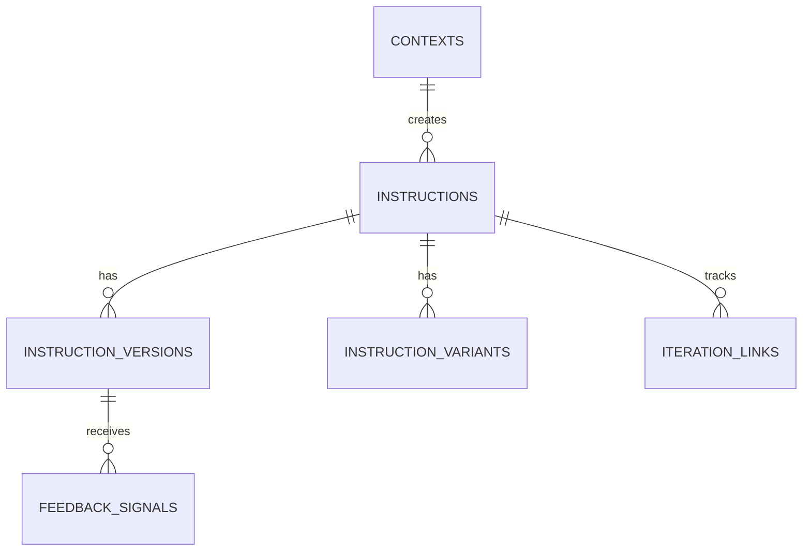

# Database Tables

- questions
- contexts
- instructions
- instruction_versions
- instruction_variants
- feedback_signals
- iteration_links

## ER Diagram (Mermaid)

```mermaid
erDiagram
    CONTEXTS ||--o{ INSTRUCTIONS : creates
    INSTRUCTIONS ||--o{ INSTRUCTION_VERSIONS : has
    INSTRUCTIONS ||--o{ INSTRUCTION_VARIANTS : has
    INSTRUCTION_VERSIONS ||--o{ FEEDBACK_SIGNALS : receives
    INSTRUCTIONS ||--o{ ITERATION_LINKS : tracks
```
